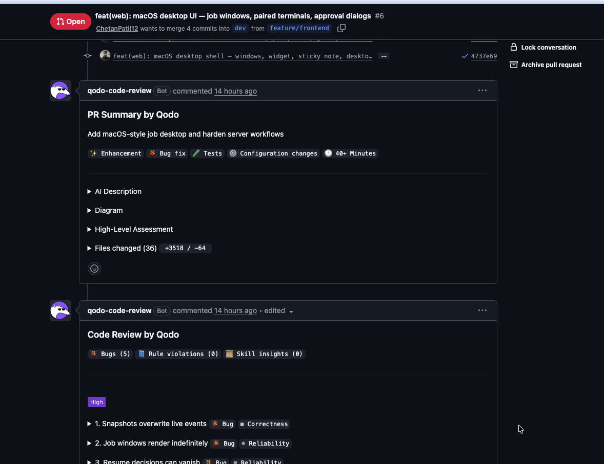

# Taro — Autonomous Multi-Party Coordination on TrueForge

> **One agent. Every party. Nothing binding without a human.**
>
> Built solo for the [Agent Harness Hackathon](https://www.wemakedevs.org/hackathons/trueforge) by WeMakeDevs × TrueFoundry (Aug 24–30, 2026).

**🎬 Demo video (3 min):** https://www.youtube.com/watch?v=JCZfD7WcYtA

---

## The problem

Today's AI agents are single-threaded socially: one agent, one user, one conversation. Real work is not. A residential roofing repair involves a homeowner, a project manager, a subcontractor crew, and a materials supplier — and the _work_ is rarely what fails. What fails is the **coordination**: relaying decisions, reconciling calendars, chasing approvals, forwarding quotes. In small field-service businesses (roofing, plumbing, electrical, events), a handful of employees coordinate dozens of concurrent clients by phone and text. The industry's dominant software (job trackers, CRMs) _records_ this coordination — nothing _performs_ it.

## What Taro does

Taro is a general-purpose **multi-party coordination engine**. You describe any job as a freeform brief — the people involved, constraints, budgets, deadlines, in plain prose — and a TrueForge-hosted agent:

1. **Derives an execution plan** (a dependency-ordered step DAG) from your prose, validates its own graph with generated code in a sandbox, and submits it for human review — with an iterative _request-changes_ loop until you approve.
2. **Coordinates every party in parallel** — one ephemeral subagent per affected party per event, fanning out consequences of each message ("Sarah is free Thursday" → subcontractor scheduling → materials lead-times → PM sign-off).
3. **Resolves conflicts with runtime-generated code** — cross-job double-bookings, multi-constraint scheduling, and money math are computed by Python the agent writes on the fly and executes in an isolated sandbox, leaving the script + output as an audit trail.
4. **Pauses for human approval before anything irreversible** — confirming dates, sharing pricing, sending documents. The harness suspends the run; the coordinator reviews the _actual generated files_ at the gate before anything reaches a real person.

Nothing in the engine knows what a roof is. The roofing job is one demo preset; the same engine coordinates a wedding, an office move, or a film shoot — because **all job logic is runtime input**, which is precisely why the harness's sandbox and approval machinery are load-bearing rather than decorative.

## Architecture

```
┌─────────────┐   REST + WS    ┌──────────────────────────────┐
│  React SPA  │◄──────────────►│  Taro server (Fastify)       │
│ macOS-style │                │  • REST API + WebSocket hub  │
│  desktop    │                │  • Event router (turns)      │
└─────────────┘                │  • MCP endpoint  /mcp        │
                               │  • SQLite (Drizzle, WAL)     │
                               └───────┬──────────────▲───────┘
                     TrueForge SDK     │              │  MCP tool calls
                 (sessions, turns,     │              │  (streamable HTTP,
                  SSE event stream)    ▼              │   bearer auth)
                               ┌──────────────────────┴───────┐
                               │  TrueForge  (localhost:8790) │
                               │  • planner agent (GPT-5.1)   │
                               │  • orchestrator (GPT-5-mini) │
                               │  • fork-join subagents       │
                               │  • native approval gates     │
                               └───────────────┬──────────────┘
                                               │ code / file exec
                                               ▼
                                        ┌─────────────┐
                                        │   Daytona   │
                                        │   sandbox   │
                                        └─────────────┘
```

The division of responsibility is strict:

- **TrueForge owns cognition** — planning, per-party message composition, conflict resolution, deciding when code or a gate is needed.
- **The Taro server owns events and state** — it never reasons. It translates world events (a party's message, an approval click) into harness turns, consumes the SSE event stream, and mirrors everything into SQLite and the live UI.
- **The human owns irreversible decisions** — via TrueForge's native tool-approval gates.

### Key architectural decisions

**SQLite is the shared memory; subagents are stateless.** TrueForge subagents are fork-join workers (spawned per turn, return summaries, root waits). Taro pairs them with persistent per-party context in the database: every subagent calls `get_party_context` before composing, so _continuity lives in the data layer, not the session_. Subagents never talk to each other — the orchestrator is the only bridge, which keeps consistency trivially enforceable.

**Turn-based execution is the safety model.** Work happens inside bounded harness turns (up to 60 iterations each); turns start when the world changes. The event router serializes one running turn per job and respects the harness constraint that message inputs and approval inputs never mix in a turn. A gate suspends the run _mid-turn_; resumption is an explicit human act. This is not a workaround — it is why human oversight has somewhere to attach.

**Dual-model cost tiering.** Planning is one hard turn; coordination is many cheap ones. A `taro-planner` agent (GPT-5.1) handles `PLAN_REQUEST`/`PLAN_REVISION`; a `taro-orchestrator` agent (GPT-5-mini, ~5× cheaper) takes over at approval. The handoff costs nothing because state lives in SQLite — the coordinator's first act is `get_job_state`. Measured result: ~80% cost reduction with no observed loss of contract adherence. Both models are env-configurable (`PLANNER_MODEL`, `ORCHESTRATOR_MODEL`).

**Prompt-cache-conscious prompting.** The system prompt is a static string, all 9 tool schemas are preloaded into the stable prefix, and volatile data (dates, job ids) rides in appended turn messages — so OpenAI's prefix cache serves the bulk of every turn's input at ~10% price.

**Dates are injected, not assumed.** Models don't know today's date; every turn event carries a `today=YYYY-MM-DD (Weekday)` stamp and the contract requires resolving all relative dates ("tomorrow", "next week") against it.

## How Taro uses TrueForge

| Harness capability              | How Taro uses it                                                                                                                                                                                |
| ------------------------------- | ----------------------------------------------------------------------------------------------------------------------------------------------------------------------------------------------- |
| **Sessions**                    | One planner session + one coordination session per job; conversations survive reconnects and server restarts (`subscribeToTurn` + sequence numbers)                                             |
| **Subagent spawning**           | The orchestrator dynamically spawns one subagent per affected party per event — parallel composition with per-party context isolation                                                           |
| **Sandbox execution** (Daytona) | Four capability classes below — all runtime-generated code, no templates                                                                                                                        |
| **Native approval gates**       | `commit_decision` is registered with `require_approval_for_tools`; `tool.approval_required` events pause the run and surface as macOS-style system dialogs with **reviewable file attachments** |
| **MCP integration**             | 9 custom tools served over streamable HTTP from the same process as the REST API (schemas preloaded; optional bearer-token auth via TrueForge header-auth)                                      |
| **Event stream**                | Every turn's SSE stream is decoded live into a per-job "harness terminal": tool calls with resolved arguments, subagent threads, sandbox provisioning, gate raises, and a per-turn scoreboard   |

### Sandbox capability classes

The honesty test for each: _an LLM can't reliably do this in-context, or it produces something only code can produce._ Language tasks (composing messages, drafting plans) deliberately stay in-model.

1. **Workflow validation** — the agent validates its _own_ derived step DAG (cycle detection, undefined party references, unreachable steps) before showing a human. Jobs are unbounded runtime input; eyeballing doesn't scale.
2. **Deterministic computation** — multi-constraint schedule resolution (cross-job registry commitments × per-party working days × lead times), exact money math, coded approval thresholds. The generated script and its output are stored on the conflict record as an audit trail.
3. **Document generation** — quotes, ledgers, schedules compiled from job state into real files, registered via `store_artifact`, retrieved through the harness's turn-sandbox download API, and delivered as file cards in party chats.
4. **Untrusted file processing** — party-uploaded files are parsed _only_ inside the sandbox; extracted data crosses into job state only through an approval gate. Most systems sandbox their own code — Taro also sandboxes _the outside world's data_.

### The safety contract (control & oversight)

The orchestrator operates under an explicit turn contract with mechanical tripwires — designed so a smaller model can follow them deterministically:

- **Gate tripwire**: any outbound message that confirms/locks/books anything, or attaches a document, requires a prior approved `commit_decision`. _Party agreement is not approval_ — even when every party says yes, the coordinator's gate is the authority.
- **Money rule**: no party ever sees a price they haven't seen before without a gate. Relaying one party's pricing to another is always gated.
- **Document rule**: generate → gate (with the files attached for the coordinator to open and read) → only then send. Generating in the sandbox is free; _sharing_ is gated.
- **Coordinator conditionals**: "after my approval" / "ask me first" must be honored at the gate — the agent may not collect approval in chat.
- **Coordinator directives**: the designated coordinator can command the agent — status reports, follow-ups, compose-and-forward documents — without ever bypassing gates.

During development the agent _did_ attempt to route around the gate by collecting approval conversationally; the contract now names that pattern a violation. Closing that loophole is, in miniature, the whole argument for agent harnesses.

## The interface

A macOS-style desktop where each job is a **window** (party chat tabs, live step DAG, conflicts, artifacts) with an inseparable **harness terminal** beneath it — opening a job opens its terminal, and the terminal cannot be closed while the job is open, so _agent activity is structurally impossible to hide_. Approval gates arrive as system dialogs. Parallel jobs are parallel windows. Hosted mode adds a lock screen: browsing is open; using the agent prompts for the visitor's own OpenAI key (validated with OpenAI, rotated into the harness's model provider in memory, never persisted).

## MCP tools (9)

| Tool                          | Purpose                                                                               |
| ----------------------------- | ------------------------------------------------------------------------------------- |
| `get_job_state`               | Full shared-state snapshot (the orchestrator's first call every turn)                 |
| `get_party_context`           | Per-party history + constraints (every subagent's first call)                         |
| `post_party_message`          | Deliver a message; optional `artifact_id` renders a document card in chat             |
| `update_step_status`          | Step lifecycle + live DAG updates; completes/reopens the job                          |
| `flag_conflict`               | Conflict records with sandbox script/output as audit trail                            |
| `commit_decision`             | **The gated tool** — every binding action passes through it                           |
| `check_resource_availability` | Cross-job double-booking detection against the party registry                         |
| `save_execution_plan`         | Persists the plan and **defines the step DAG** (one step per item, with `depends_on`) |
| `store_artifact`              | Registers sandbox-generated files for download and chat delivery                      |

## Setup

### Prerequisites

- Node.js ≥ 22.13, pnpm ≥ 9
- A [Daytona](https://daytona.io) API key (sandbox execution)
- An OpenAI API key

### Run locally (three terminals)

```bash
# 0. once:
git clone https://github.com/ChetanPatil12/taro && cd taro
pnpm install
cp .env.example .env   # fill in OPENAI_API_KEY and DAYTONA_API_KEY

# 1. the harness
npx @truefoundry/trueforge@latest

# 2. the Taro server (registers the MCP server + both agents automatically)
cd apps/server && pnpm start

# 3. the web app
cd apps/web && pnpm dev
```

Open http://localhost:5173, click **Roofing Demo**, review the brief, and create the job. Set `REQUIRE_UNLOCK=true` on the server to enable hosted-style BYOK gating.

> On first run, configure the model + sandbox providers once via the Taro server's startup (automatic when keys are present in `.env`) — or through TrueForge's UI at http://localhost:8790.

### Single-container deployment

```bash
docker build -t taro .
docker run -p 8000:8000 -v taro-data:/data -e DAYTONA_API_KEY=... taro
```

One container runs TrueForge + the Taro server + the built UI. TrueForge stays on the container's loopback (it is not internet-hardened by design); only port 8000 is exposed, with BYOK unlock on by default. There is no external database — SQLite is embedded, which is also why the deployment is one service instead of three.

### Tests

```bash
pnpm test        # 40 Vitest cases: tools, routes, driver approval batching, schema invariants
pnpm lint && pnpm typecheck
```

## Qodo Code Review Evidence

This project used Qodo on **every pull request** from the first commit, per the hackathon rules. Qodo ran in deep-review mode and produced genuinely material findings.



**Representative PR:** [#5 — REST API, event router, orchestrator agent](https://github.com/ChetanPatil12/taro/pull/5) — 8 findings; 6 fixed, 2 dismissed with written reasons in-thread.

**What Qodo surfaced and what we did (selection):**

| PR                                                 | Finding                                                                                              | Severity | Response                                                                                                                                            |
| -------------------------------------------------- | ---------------------------------------------------------------------------------------------------- | -------- | --------------------------------------------------------------------------------------------------------------------------------------------------- |
| [#1](https://github.com/ChetanPatil12/taro/pull/1) | `dotenv/config` resolved against cwd — root `.env` silently ignored under workspace-filtered scripts | High     | Fixed: env files resolved relative to the module, with correct precedence                                                                           |
| [#2](https://github.com/ChetanPatil12/taro/pull/2) | `job_log`/`files` could attribute a row to a party from a _different job_                            | Medium   | Fixed with a composite FK `(job_id, party_id) → parties(job_id, id)` + tests                                                                        |
| [#4](https://github.com/ChetanPatil12/taro/pull/4) | Unauthenticated `/mcp` on `0.0.0.0` = approval-bypass surface                                        | High     | Fixed: loopback bind by default + bearer shared-secret enforced via TrueForge header-auth                                                           |
| [#4](https://github.com/ChetanPatil12/taro/pull/4) | `next_available_date` could land on an adjacent booking                                              | Medium   | Fixed: walk-forward re-checks every candidate window against **all** commitments                                                                    |
| [#5](https://github.com/ChetanPatil12/taro/pull/5) | Upload filename path traversal could escape the files directory                                      | High     | Fixed: `basename` + charset allowlist; test proves `../../../etc` stays contained                                                                   |
| [#5](https://github.com/ChetanPatil12/taro/pull/5) | Multi-gate turns resumed with partial approvals                                                      | Medium   | Fixed: decisions batch until no gate is undecided, then resume in one turn (`approvals.resumed` migration)                                          |
| [#5](https://github.com/ChetanPatil12/taro/pull/5) | REST endpoints lack per-user authorization                                                           | High     | **Dismissed with reason** (in-thread): single-operator demo bound to loopback; no user model exists to authorize against; documented as future work |

All High-severity findings were fixed or dismissed with a written justification in the PR thread; every fix shipped with regression tests, and Qodo re-reviews marked findings **✓ Resolved** before merge.

**Full PR history:** https://github.com/ChetanPatil12/taro/pulls?q=is%3Apr

## Future work

Real party channels (SMS/email via Twilio), per-user authorization and durable event outbox, Postgres for multi-tenant scale, timeline-feasibility checks at plan time, and template libraries over the freeform engine.

## AI disclosure

Planning and implementation were done with an AI coding assistant; all code was reviewed, tested, and is understood by the participant.

## License

[MIT](LICENSE)
